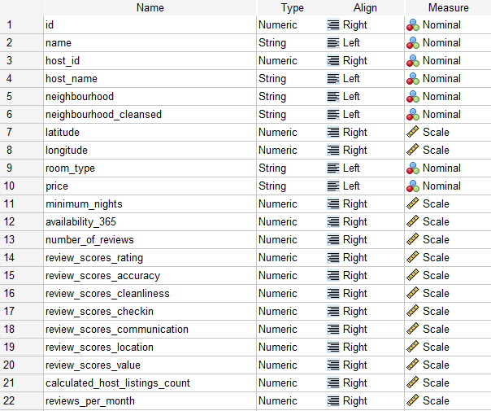

# Øvelse: Data klargøring og beskrivende statistik

Denne opgave handler om Airbnb-opslag i København (til september 2022). Data er indsamlet fra [Inside Airbnb](http://insideairbnb.com/copenhagen). Du er velkommen til at udforske hjemmesiden yderligere for at få en bedre forståelse af data. Data ([listings.xlsx](listings.xlsx)) er indsamlet som rådata og skal behandles forud for anvendelse. I denne opgave skal du følge nedenstående punkter.

1. Først skal vi fjerne alle overflødige kolonner. Behold venligst følgende 22 kolonner og fjern alle andre. Hæft dig også ved typen og "measure" og sørg for at ændre din egne data så de ligner dette:

  

2. Rens data så de ikke længere indeholder manglende værdier, outliers, osv. - du vælger selv om du vil fjerne eller erstatte (eller beholde outliers). Husk dog at argumentere for dit valg.

3. Nu skal vi rette værdierne for `neighbourhood_cleansed` (nogle mangler 'æ ø å'), og om nødvendigt ændre prisen til DKK (værdien er i DKK, men SPSS kan muligvis tro, at den er i amerikanske dollars).

4. Opret en ny kolonne ved hjælp af bins for prisen. Brug 11 bins, der er jævnt fordelt, men hvor den sidste bin er $> 10.000$.

5. Opret boksplots, hvor du har kvarteret på x-aksen og prisen (de binnede) på y-aksen. Hvad fortæller dette dig om opslagene i København? Behold x-aksen som den er, og flyt forskellige variable til y-aksen for at se, hvordan tingene fordeler sig mellem kvartererne. Konkluder på analysen.

6. Opret et søjlediagram over værterne med de ti fleste opslag (altså med top ti listings = antallet af forskellige udlejningsboliger). Placer værts-id på x-aksen og antallet af opslag på y-aksen.

7. Lav en beskrivende analyse af kvartererne. Brug **Descriptive Statistics** platformen. Inkluder oplysninger om værelsestype i analysen. Konkluder på analysen.

8. Giv en liste over de 10 bedst bedømte opslag.

9. Opret endnu en ny kolonne, hvor prisen nu kun deles i to dele: "dyre" boliger defineret ved alle boliger med en pris højere end median-prisen, og "billige" boliger defineret ved alle boliger med en pris lig med eller under median-prisen. Du kan kode de billige boliger "0" og de dyre "1". Alle listings bør nu have en klassifikation på enten dyre boliger (1) eller billige boliger (0).

10. Lav en beskrivende analyse af de to klasser af listings (de dyre og de billige). Brug **Descriptive Statistics** platformen. Inkluder oplysninger om værelsestype i analysen. Konkludér på analysen.
